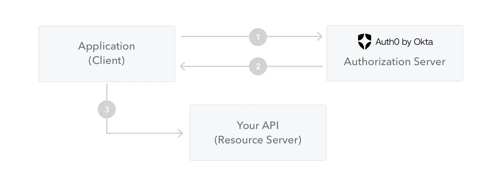

# what-is-jwt
JWT is a format of signed strings containing session information.

# What does it solve?
With traditional session, when user login, there are 2 problems:
- Server need to save session's information like: user_id, role, permissions, .etc -> If there are millions of users, we need to save millions of records
- If we have multiple servers and load balancer, we need to synchronize session between servers. 
-> Let's see how JWT works.

JWT is self-contained, all the information is saved in the token. Server doesn't save session's information. When a request comes, server only needs to decode and verify the signature of the token. -> This help system become easier to scale.

# How does it work?
JWT - JSON Web Token consists of three parts separated by dots:
- Header -> xxx
- Payload -> yyy
- Signature -> zzz
-> xxx.yyy.zzz

Header
```
{
  "alg": "HS256", -> Signing algorithm
  "typ": "JWT" -> type of the token
}
```

Payload
Additional data, an example:
```
{
  "sub": "1234567890",
  "name": "John Doe",
  "admin": true,
  "exp": 8292812948
}
```

Example of signature
```
base64UrlEncode(
  HMACSHA256(
    base64UrlEncode(header) + "." +
    base64UrlEncode(payload),
    secret
  )
)
```


1. The application or client requests authorization to the authorization server.
2. When the authorization is granted, the authorization server returns an access token to the application.
3. The application uses the access token to access a protected resource (like an API).
Do note that with signed tokens, all the information contained within the token is exposed to users or other parties, even though they are unable to change it. This means you should not put secret information within the token.
# FAQ
1. How do we revoke a JWT?
- Problem: Because the server is stateless, it cannot easily invalidate a token before its exp time if use logs out.
- Solution: Temporarily storing revoked token IDs in a fast in-memory store like Redis or short exp times.

2. Where should we store JWTs on the client side?
- Option 1 (LocalStorage/SessionStorage): Easy to use but vulnerable to XSS (Cross-Site Scripting) attacks.
- Option 2 (HttpOnly, Secure Cookies): Secure against XSS, but requires handling CSRF (Cross-Site Request Forgery)

# References
https://www.jwt.io/introduction